# SATHI - Architectural Overview

## Table of Contents

1. [System Architecture Overview](#system-architecture-overview)
2. [High-Level System Design](#high-level-system-design)
3. [Microservices Architecture](#microservices-architecture)
4. [Data Architecture](#data-architecture)
5. [AI/ML Architecture](#aiml-architecture)
6. [Security Architecture](#security-architecture)
7. [Deployment Architecture](#deployment-architecture)
8. [Scalability & Performance](#scalability--performance)
9. [Integration Architecture](#integration-architecture)
10. [Monitoring & Observability](#monitoring--observability)

## System Architecture Overview

SATHI (System for Analyzing and Tracking Human Intelligence) is designed as a modern, scalable mental health monitoring platform for CRPF personnel. The architecture follows microservices principles with clear separation of concerns, ensuring maintainability, scalability, and reliability.

### Core Architecture Principles

1. **Modularity**: Clean separation between frontend, backend, AI/ML services, and data layer
2. **Scalability**: Horizontal scaling capabilities for high-load scenarios
3. **Security**: Multi-layered security approach with encryption and access controls
4. **Resilience**: Fault-tolerant design with graceful degradation
5. **Maintainability**: Well-structured codebase with clear interfaces and documentation

## High-Level System Design

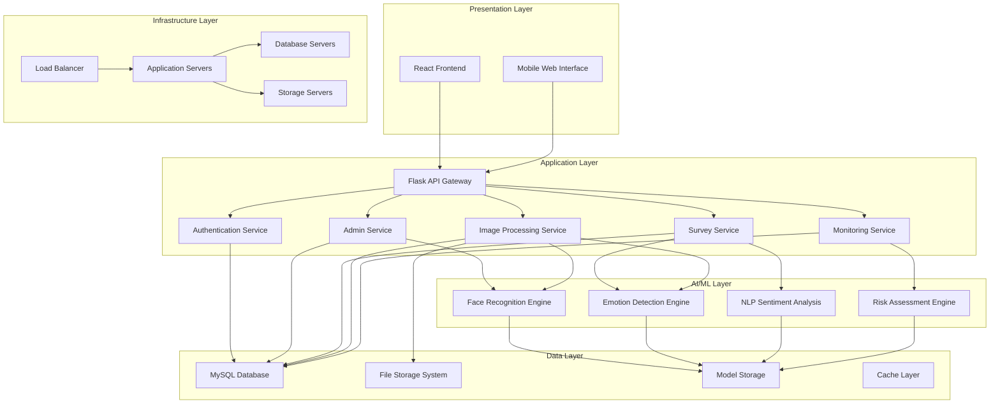

### System Components

| Component | Technology | Purpose |
|-----------|------------|---------|
| Frontend | React + TypeScript | User interface and interaction |
| API Gateway | Flask | Request routing and authentication |
| Database | MySQL 8.0 | Primary data storage |
| AI/ML Services | TensorFlow, OpenCV | Machine learning processing |
| File Storage | Local/Cloud Storage | Image and model file storage |
| Cache | Redis (Optional) | Performance optimization |

## Microservices Architecture

### Service Decomposition

The SATHI system is organized into focused microservices, each handling specific business capabilities:

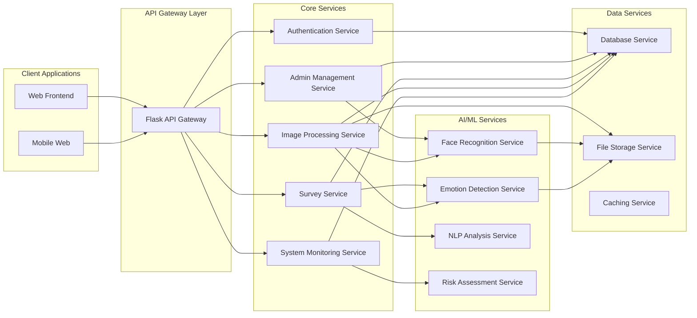

### Service Responsibilities

#### Authentication Service
- User authentication and authorization
- Session management
- Role-based access control
- Security token validation

#### Admin Management Service
- Dashboard statistics and analytics
- User management (soldiers/admins)
- System configuration
- Report generation

#### Survey Service
- Questionnaire management
- Survey response collection
- Sentiment analysis integration
- Mental health scoring

#### Image Processing Service
- Face detection and recognition
- Image collection and training
- Model management
- Batch processing capabilities

#### System Monitoring Service
- Health checks and system status
- Performance monitoring
- Alert management
- Log aggregation

### Inter-Service Communication

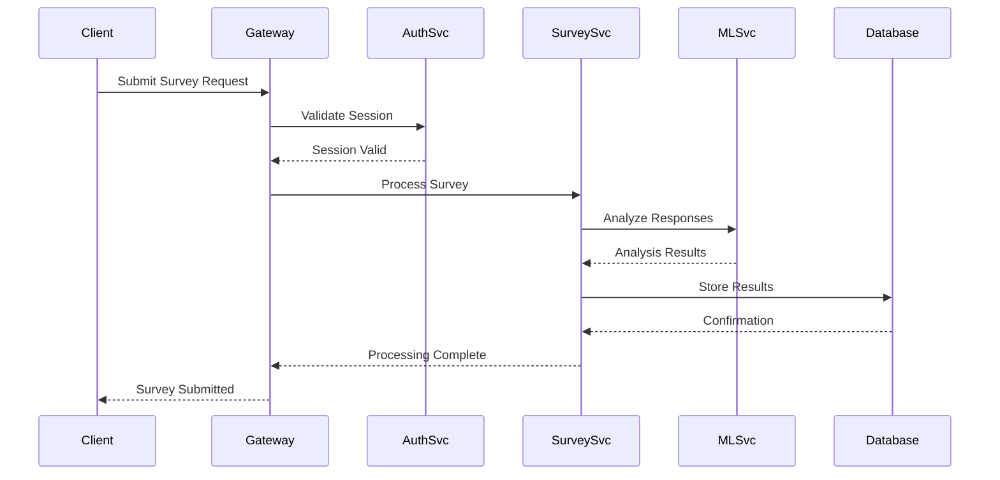

## Data Architecture

### Database Design

The system uses a normalized relational database design optimized for mental health data management:

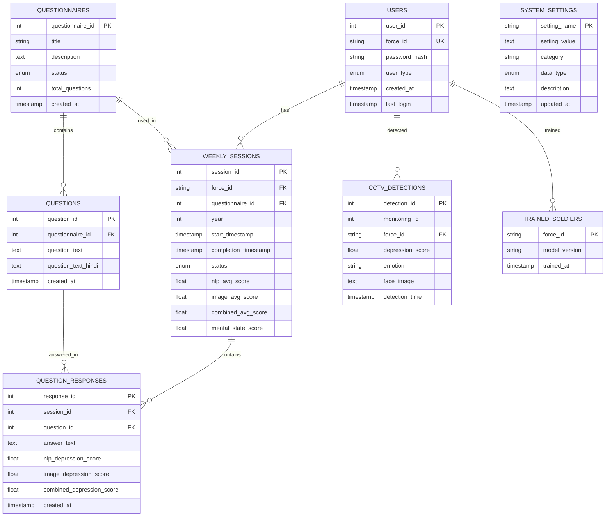

### Data Flow Architecture

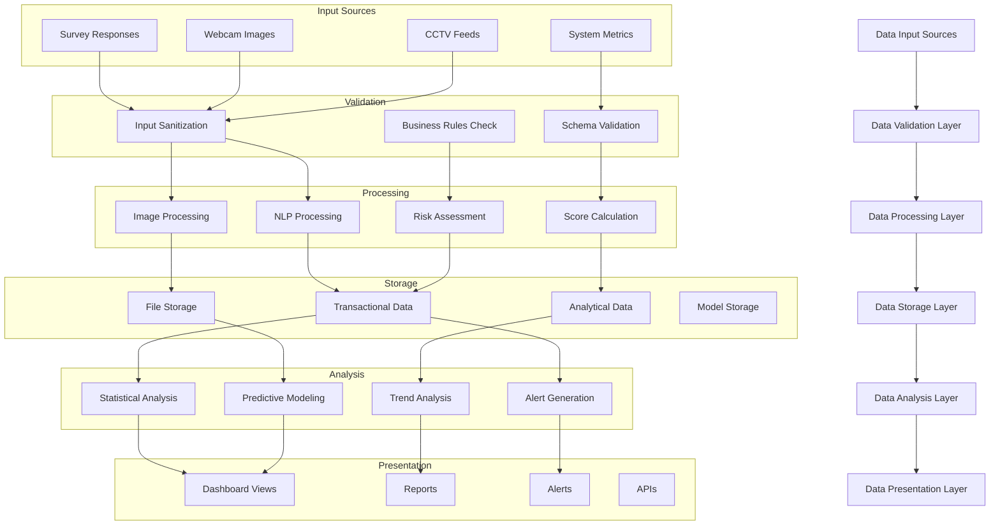

### Data Consistency and Integrity

#### ACID Compliance
- **Atomicity**: All database operations are atomic
- **Consistency**: Data integrity constraints are enforced
- **Isolation**: Concurrent transactions are properly isolated
- **Durability**: Committed data is permanently stored

#### Data Validation Layers
1. **Frontend Validation**: Client-side input validation
2. **API Validation**: Server-side request validation
3. **Database Constraints**: Schema-level data integrity
4. **Business Logic Validation**: Domain-specific rules

## AI/ML Architecture

### Machine Learning Pipeline

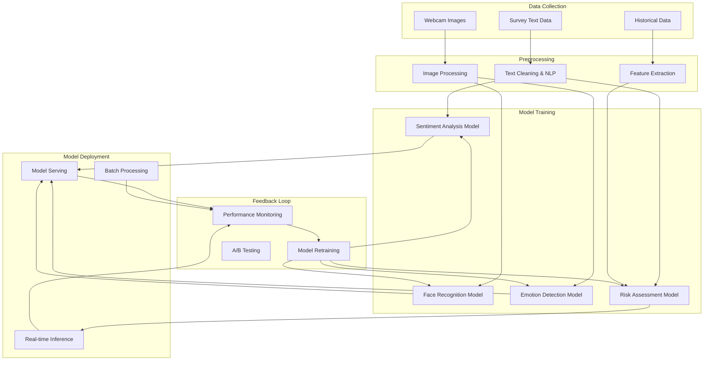

### AI/ML Components Detail

#### 1. Natural Language Processing Engine
```python
# Architecture Pattern
class NLPAnalysisEngine:
    def __init__(self):
        self.preprocessor = TextPreprocessor()
        self.sentiment_analyzer = SentimentAnalyzer()
        self.depression_scorer = DepressionScorer()
    
    def analyze_text(self, text: str) -> AnalysisResult:
        # Text preprocessing
        cleaned_text = self.preprocessor.clean(text)
        
        # Sentiment analysis
        sentiment = self.sentiment_analyzer.analyze(cleaned_text)
        
        # Depression scoring
        depression_score = self.depression_scorer.calculate(sentiment)
        
        return AnalysisResult(
            sentiment=sentiment,
            depression_score=depression_score,
            confidence=sentiment.confidence
        )
```

#### 2. Face Recognition Engine
```python
# Architecture Pattern
class FaceRecognitionEngine:
    def __init__(self):
        self.face_detector = HaarCascadeDetector()
        self.feature_extractor = FaceFeatureExtractor()
        self.model_manager = FaceModelManager()
    
    def process_image(self, image: np.ndarray) -> RecognitionResult:
        # Face detection
        faces = self.face_detector.detect(image)
        
        # Feature extraction
        encodings = self.feature_extractor.extract(image, faces)
        
        # Face matching
        matches = self.model_manager.match_faces(encodings)
        
        return RecognitionResult(
            faces_detected=len(faces),
            matches=matches,
            confidence_scores=[m.confidence for m in matches]
        )
```

#### 3. Emotion Detection Engine
```python
# Architecture Pattern
class EmotionDetectionEngine:
    def __init__(self):
        self.face_preprocessor = FacePreprocessor()
        self.emotion_model = EmotionClassificationModel()
        self.depression_mapper = EmotionDepressionMapper()
    
    def detect_emotion(self, face_image: np.ndarray) -> EmotionResult:
        # Face preprocessing
        processed_face = self.face_preprocessor.preprocess(face_image)
        
        # Emotion classification
        emotions = self.emotion_model.predict(processed_face)
        
        # Depression score mapping
        depression_score = self.depression_mapper.map_to_depression(emotions)
        
        return EmotionResult(
            dominant_emotion=emotions.dominant,
            all_emotions=emotions.all,
            depression_score=depression_score
        )
```

### Model Management Architecture

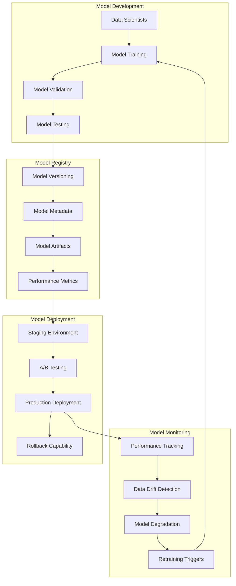

## Security Architecture

### Multi-Layered Security Approach

```mermaid
graph TB
    subgraph "Application Security"
        A1[Authentication Layer]
        A2[Authorization Layer]
        A3[Session Management]
        A4[Input Validation]
    end
    
    subgraph "Data Security"
        B1[Data Encryption]
        B2[Database Security]
        B3[File System Security]
        B4[Backup Security]
    end
    
    subgraph "Network Security"
        C1[HTTPS/TLS]
        C2[Firewall Rules]
        C3[VPN Access]
        C4[API Rate Limiting]
    end
    
    subgraph "Infrastructure Security"
        D1[Server Hardening]
        D2[Access Controls]
        D3[Monitoring & Logging]
        D4[Intrusion Detection]
    end
    
    A1 --> A2
    A2 --> A3
    A3 --> A4
    
    B1 --> B2
    B2 --> B3
    B3 --> B4
    
    C1 --> C2
    C2 --> C3
    C3 --> C4
    
    D1 --> D2
    D2 --> D3
    D3 --> D4
```

### Authentication & Authorization Flow

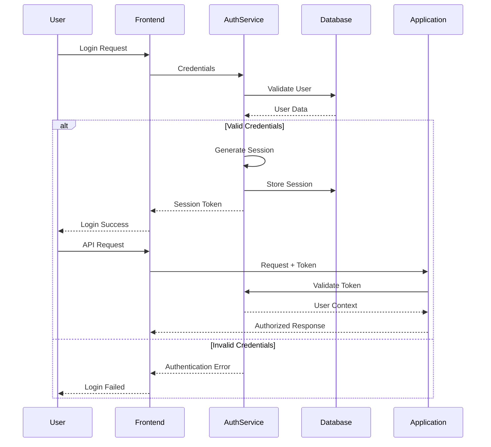

### Data Protection Strategies

#### 1. Data Classification
| Classification | Description | Protection Level |
|----------------|-------------|------------------|
| Public | General system information | Basic encryption |
| Internal | Operational data | Standard encryption |
| Confidential | Personal information | Advanced encryption |
| Restricted | Mental health data | Maximum encryption |

#### 2. Encryption Implementation
```python
# Data Encryption Architecture
class DataEncryption:
    def __init__(self):
        self.key_manager = KeyManager()
        self.cipher = AESCipher()
    
    def encrypt_sensitive_data(self, data: dict) -> str:
        """Encrypt sensitive mental health data"""
        key = self.key_manager.get_encryption_key()
        encrypted_data = self.cipher.encrypt(data, key)
        return encrypted_data
    
    def decrypt_sensitive_data(self, encrypted_data: str) -> dict:
        """Decrypt sensitive mental health data"""
        key = self.key_manager.get_encryption_key()
        decrypted_data = self.cipher.decrypt(encrypted_data, key)
        return decrypted_data
```

#### 3. Access Control Matrix
| Role | Survey Data | User Management | System Config | Reports |
|------|-------------|-----------------|---------------|---------|
| Admin | Full Access | Full Access | Full Access | Full Access |
| Soldier | Own Data Only | No Access | No Access | No Access |
| Viewer | Read Only | No Access | No Access | Read Only |

## Deployment Architecture

### Container-Based Deployment

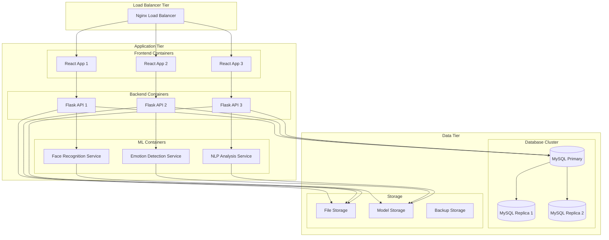

### Cloud Deployment Options

#### AWS Architecture
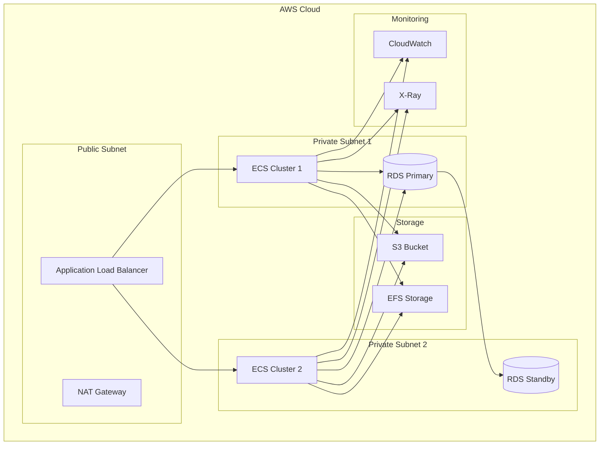

### Deployment Environments

#### Environment Configuration
| Environment | Purpose | Resources | Deployment |
|-------------|---------|-----------|------------|
| Development | Local development | Minimal | Docker Compose |
| Testing | Automated testing | Medium | Kubernetes |
| Staging | Pre-production testing | Production-like | Kubernetes |
| Production | Live system | High availability | Kubernetes/Cloud |

#### CI/CD Pipeline
```mermaid
graph LR
    A[Code Commit] --> B[Build Trigger]
    B --> C[Unit Tests]
    C --> D[Integration Tests]
    D --> E[Security Scan]
    E --> F[Build Images]
    F --> G[Deploy to Staging]
    G --> H[E2E Tests]
    H --> I[Deploy to Production]
    I --> J[Health Checks]
    J --> K[Monitoring]
```

## Scalability & Performance

### Horizontal Scaling Strategy

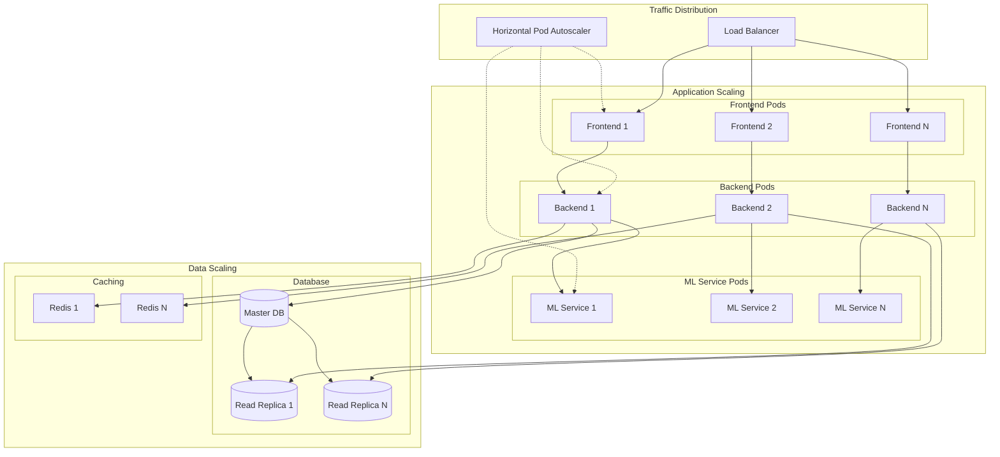

### Performance Optimization Strategies

#### 1. Database Optimization
```sql
-- Index optimization for frequent queries
CREATE INDEX idx_weekly_sessions_force_completion 
ON weekly_sessions(force_id, completion_timestamp);

CREATE INDEX idx_question_responses_session 
ON question_responses(session_id, question_id);

CREATE INDEX idx_cctv_detections_force_time 
ON cctv_detections(force_id, detection_time);

-- Partitioning for large tables
CREATE TABLE weekly_sessions_2024 PARTITION OF weekly_sessions
FOR VALUES FROM ('2024-01-01') TO ('2025-01-01');
```

#### 2. Caching Strategy
```python
# Multi-level caching architecture
class CacheManager:
    def __init__(self):
        self.memory_cache = MemoryCache()  # L1 Cache
        self.redis_cache = RedisCache()    # L2 Cache
        self.database = DatabaseLayer()    # L3 Storage
    
    def get_dashboard_stats(self, timeframe: str) -> dict:
        # Check L1 cache first
        cache_key = f"dashboard_stats_{timeframe}"
        
        # L1 Cache check
        result = self.memory_cache.get(cache_key)
        if result:
            return result
        
        # L2 Cache check
        result = self.redis_cache.get(cache_key)
        if result:
            self.memory_cache.set(cache_key, result, ttl=300)
            return result
        
        # Database query
        result = self.database.get_dashboard_stats(timeframe)
        
        # Cache at both levels
        self.redis_cache.set(cache_key, result, ttl=1800)
        self.memory_cache.set(cache_key, result, ttl=300)
        
        return result
```

#### 3. ML Model Optimization
```python
# Model serving optimization
class ModelServingOptimizer:
    def __init__(self):
        self.model_cache = ModelCache()
        self.batch_processor = BatchProcessor()
        self.async_processor = AsyncProcessor()
    
    def optimize_inference(self, requests: List[InferenceRequest]) -> List[Result]:
        # Batch similar requests
        batched_requests = self.batch_processor.group_requests(requests)
        
        # Process batches asynchronously
        tasks = []
        for batch in batched_requests:
            task = self.async_processor.submit(self.process_batch, batch)
            tasks.append(task)
        
        # Collect results
        results = []
        for task in tasks:
            batch_results = task.result()
            results.extend(batch_results)
        
        return results
```

## Integration Architecture

### External System Integration

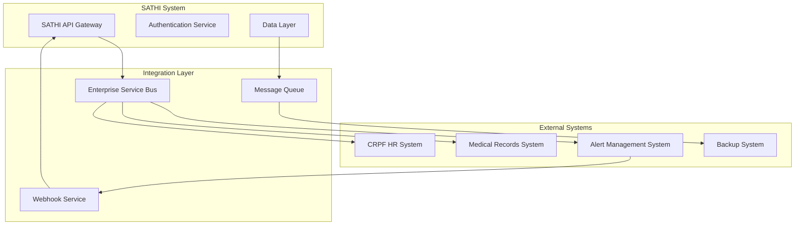

### API Integration Patterns

#### 1. Synchronous Integration
```python
# REST API integration
class ExternalAPIIntegration:
    def __init__(self, base_url: str, api_key: str):
        self.base_url = base_url
        self.api_key = api_key
        self.session = requests.Session()
        
    def sync_user_data(self, force_id: str) -> dict:
        """Synchronously fetch user data from HR system"""
        endpoint = f"{self.base_url}/personnel/{force_id}"
        headers = {"Authorization": f"Bearer {self.api_key}"}
        
        response = self.session.get(endpoint, headers=headers)
        response.raise_for_status()
        
        return response.json()
```

#### 2. Asynchronous Integration
```python
# Message queue integration
class MessageQueueIntegration:
    def __init__(self, queue_config: dict):
        self.queue = QueueManager(queue_config)
        
    async def send_alert(self, alert_data: dict):
        """Asynchronously send alert to external system"""
        message = {
            "type": "mental_health_alert",
            "data": alert_data,
            "timestamp": datetime.utcnow().isoformat()
        }
        
        await self.queue.publish("alerts", message)
        
    async def process_alerts(self):
        """Process incoming alerts from queue"""
        async for message in self.queue.subscribe("alerts"):
            await self.handle_alert(message)
```

### Data Synchronization

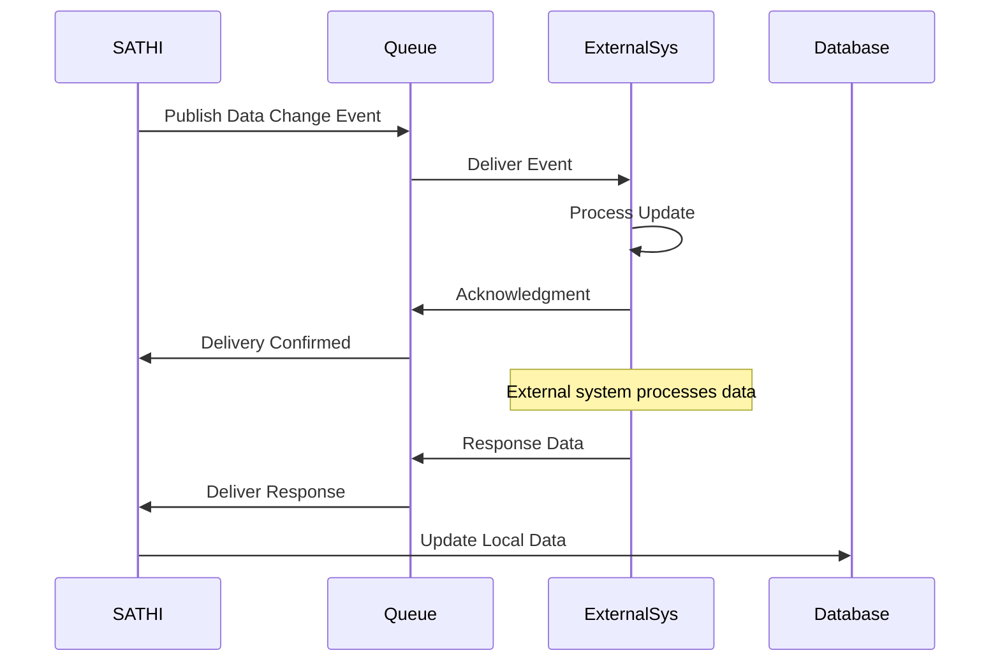

## Monitoring & Observability

### Comprehensive Monitoring Stack

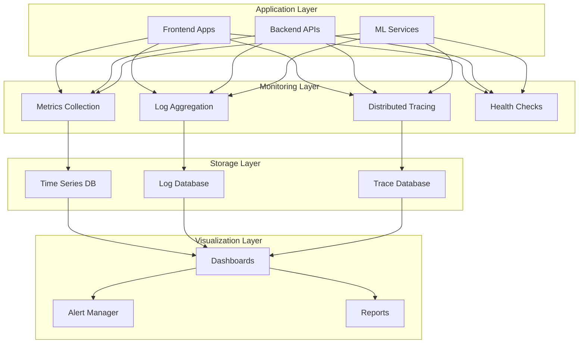

### Observability Implementation

#### 1. Application Metrics
```python
# Metrics collection
from prometheus_client import Counter, Histogram, Gauge

class ApplicationMetrics:
    def __init__(self):
        self.request_count = Counter('http_requests_total', 'Total HTTP requests', ['method', 'endpoint'])
        self.request_duration = Histogram('http_request_duration_seconds', 'HTTP request duration')
        self.active_sessions = Gauge('active_sessions_total', 'Number of active sessions')
        self.ml_inference_time = Histogram('ml_inference_duration_seconds', 'ML inference time')
    
    def record_request(self, method: str, endpoint: str, duration: float):
        self.request_count.labels(method=method, endpoint=endpoint).inc()
        self.request_duration.observe(duration)
    
    def record_ml_inference(self, model_type: str, duration: float):
        self.ml_inference_time.labels(model=model_type).observe(duration)
```

#### 2. Distributed Tracing
```python
# OpenTelemetry integration
from opentelemetry import trace
from opentelemetry.exporter.jaeger.thrift import JaegerExporter
from opentelemetry.sdk.trace import TracerProvider
from opentelemetry.sdk.trace.export import BatchSpanProcessor

class TracingSetup:
    def __init__(self):
        trace.set_tracer_provider(TracerProvider())
        tracer = trace.get_tracer(__name__)
        
        jaeger_exporter = JaegerExporter(
            agent_host_name="localhost",
            agent_port=6831,
        )
        
        span_processor = BatchSpanProcessor(jaeger_exporter)
        trace.get_tracer_provider().add_span_processor(span_processor)
    
    def trace_survey_submission(self, session_id: str):
        tracer = trace.get_tracer(__name__)
        
        with tracer.start_as_current_span("survey_submission") as span:
            span.set_attribute("session_id", session_id)
            
            with tracer.start_as_current_span("nlp_analysis"):
                # NLP processing
                pass
            
            with tracer.start_as_current_span("emotion_detection"):
                # Emotion detection
                pass
            
            with tracer.start_as_current_span("score_calculation"):
                # Score calculation
                pass
```

#### 3. Alert Configuration
```yaml
# Alert rules configuration
alerts:
  - name: HighErrorRate
    condition: error_rate > 0.05
    duration: 5m
    severity: warning
    message: "High error rate detected: {{ $value }}"
    
  - name: DatabaseConnectionFailure
    condition: db_connections_failed > 0
    duration: 1m
    severity: critical
    message: "Database connection failures detected"
    
  - name: MLModelPerformanceDegradation
    condition: ml_model_accuracy < 0.85
    duration: 10m
    severity: warning
    message: "ML model performance degraded: {{ $value }}"
    
  - name: HighMemoryUsage
    condition: memory_usage > 0.9
    duration: 5m
    severity: warning
    message: "High memory usage: {{ $value }}"
```

### Health Check Architecture

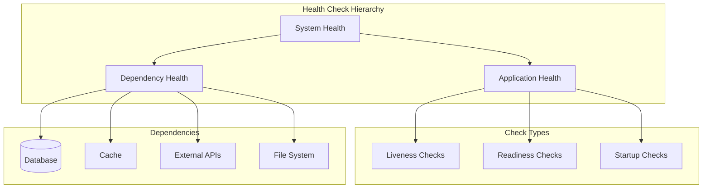

---

This architectural overview provides a comprehensive view of the SATHI system's design, covering all major architectural aspects from high-level system design to detailed implementation patterns. The architecture ensures scalability, security, and maintainability while supporting the complex requirements of mental health monitoring for CRPF personnel.