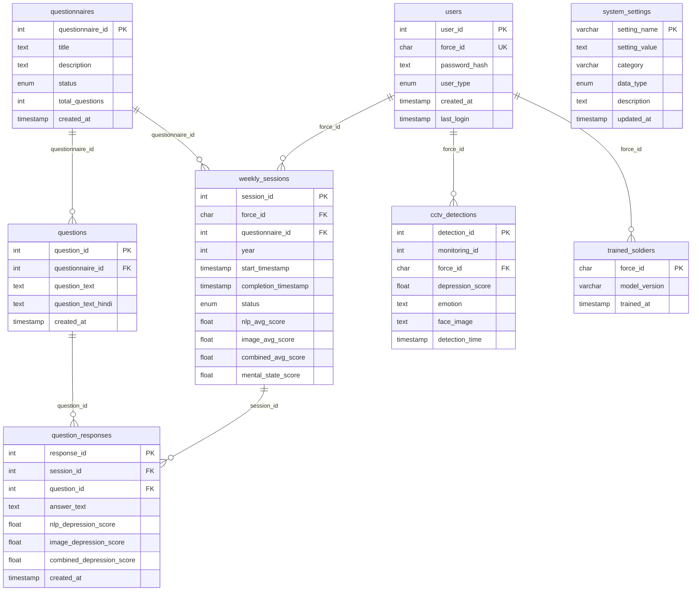
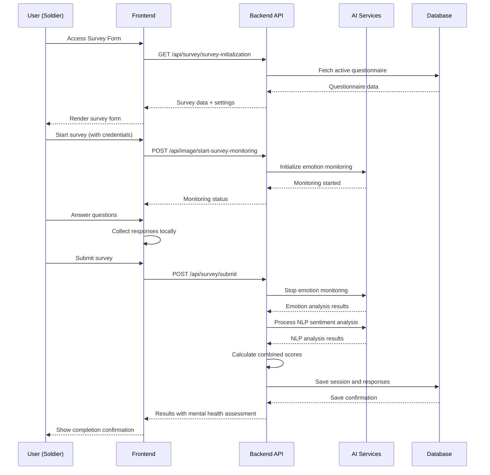
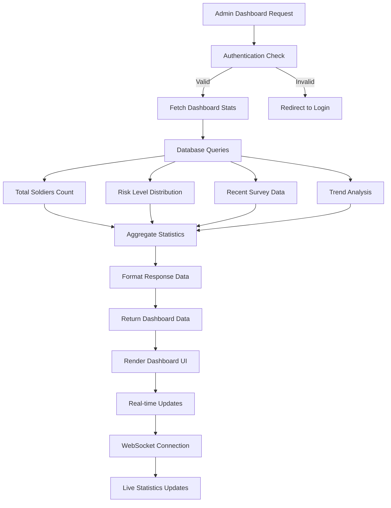
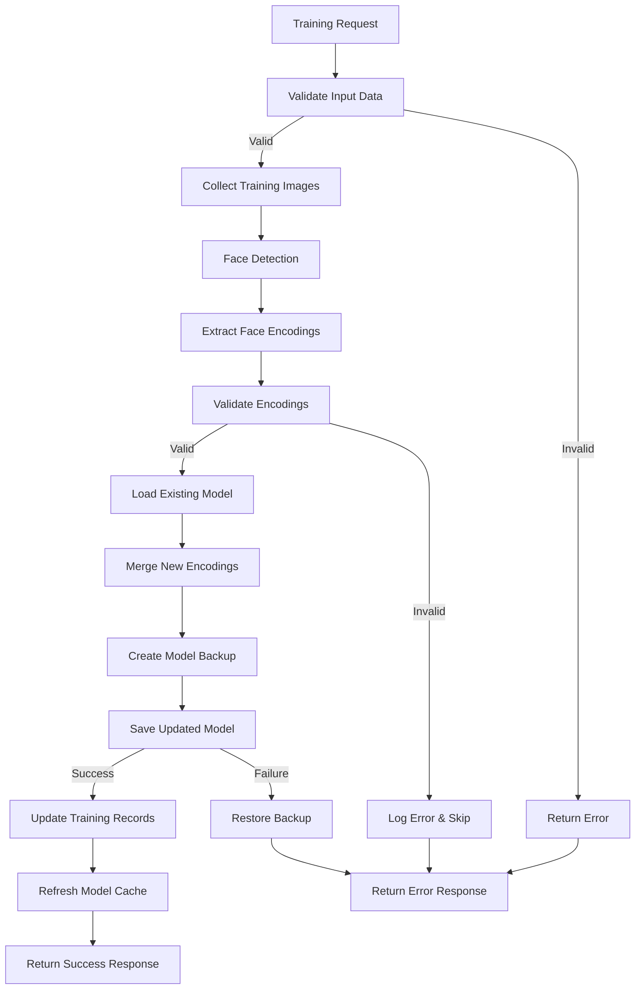

# SATHI - Developer Guide

## Table of Contents

1. [Development Environment Setup](#development-environment-setup)
2. [Codebase Architecture](#codebase-architecture)
3. [Database Design & Connections](#database-design--connections)
4. [AI/ML Components](#aiml-components)
5. [Frontend Development](#frontend-development)
6. [Backend Development](#backend-development)
7. [Data Flow Diagrams](#data-flow-diagrams)
8. [Testing & Quality Assurance](#testing--quality-assurance)
9. [Deployment Guide](#deployment-guide)
10. [Best Practices & Standards](#best-practices--standards)
11. [Troubleshooting](#troubleshooting)

## Development Environment Setup

### Prerequisites

- **Python 3.8+** with pip
- **Node.js 16+** with npm
- **MySQL 8.0+**
- **Git**
- **VS Code** (recommended IDE)

### Local Development Setup

#### 1. Repository Setup
```bash
git clone https://github.com/JayeshCC/SATHI.git
cd SATHI
```

#### 2. Backend Setup
```bash
cd backend

# Create virtual environment
python -m venv venv

# Activate virtual environment
# Windows:
venv\Scripts\activate
# macOS/Linux:
source venv/bin/activate

# Install dependencies
pip install -r requirements.txt

# Environment configuration
cp .env.example .env
# Edit .env with your settings
```

#### 3. Database Setup
```bash
# Create database
mysql -u root -p
CREATE DATABASE crpf_mental_health;
CREATE USER 'crpf_user'@'localhost' IDENTIFIED BY 'secure_password';
GRANT ALL PRIVILEGES ON crpf_mental_health.* TO 'crpf_user'@'localhost';
FLUSH PRIVILEGES;
EXIT;

# Initialize database schema
python db/init_db.py
```

#### 4. Frontend Setup
```bash
cd frontend
npm install
```

#### 5. Run Development Servers
```bash
# Backend (Terminal 1)
cd backend
python app.py

# Frontend (Terminal 2)
cd frontend
npm start
```

### Development Tools

#### Recommended VS Code Extensions
```json
{
  "recommendations": [
    "ms-python.python",
    "ms-python.flake8",
    "bradlc.vscode-tailwindcss",
    "esbenp.prettier-vscode",
    "ms-vscode.vscode-typescript-next",
    "ms-toolsai.jupyter"
  ]
}
```

#### Python Development Tools
```bash
# Code formatting
pip install black flake8 isort

# Testing
pip install pytest pytest-cov

# Development utilities
pip install python-dotenv ipython
```

## Codebase Architecture

### Backend Architecture (Flask)

```
backend/
├── api/                          # API modules
│   ├── __init__.py              # API blueprint registration
│   ├── auth/                    # Authentication module
│   │   ├── __init__.py
│   │   └── routes.py            # Auth endpoints
│   ├── admin/                   # Admin module
│   │   ├── __init__.py
│   │   ├── routes.py            # Admin endpoints
│   │   └── settings.py          # Settings management
│   ├── survey/                  # Survey module
│   │   ├── __init__.py
│   │   ├── routes.py            # Survey endpoints
│   │   └── question_timing.py   # Question timing utilities
│   ├── image/                   # Image processing module
│   │   ├── __init__.py
│   │   └── routes.py            # Image/ML endpoints
│   └── monitor/                 # Monitoring module
│       ├── __init__.py
│       └── routes.py            # Monitoring endpoints
├── config/                      # Configuration management
│   ├── __init__.py
│   └── settings.py              # Application settings
├── db/                          # Database utilities
│   ├── __init__.py
│   ├── connection.py            # Database connection
│   ├── init_db.py              # Database initialization
│   └── schema.sql              # Database schema
├── services/                    # Business logic services
│   ├── auth_service.py         # Authentication logic
│   ├── sentiment_analysis_service.py  # NLP processing
│   ├── enhanced_face_recognition_service.py  # Face recognition
│   ├── enhanced_emotion_detection_service.py  # Emotion detection
│   ├── cctv_monitoring_service.py  # CCTV monitoring
│   ├── translation_service.py  # Language translation
│   └── notification_service.py # Notification handling
├── utils/                       # Utility functions
│   ├── __init__.py
│   └── session_utils.py        # Session utilities
├── model/                       # ML models storage
├── storage/                     # File storage
│   ├── uploads/                # User uploaded images
│   ├── models/                 # Trained ML models
│   └── backups/               # System backups
└── app.py                      # Main application entry
```

### Frontend Architecture (React TypeScript)

```
frontend/src/
├── components/                  # Reusable UI components
│   ├── common/                 # Common components
│   ├── layout/                 # Layout components
│   └── charts/                 # Chart components
├── pages/                      # Application pages
│   ├── admin/                  # Admin pages
│   │   ├── dashboard.tsx       # Admin dashboard
│   │   ├── settings.tsx        # System settings
│   │   ├── soldiers.tsx        # Soldier management
│   │   └── advanced-search.tsx # Advanced search
│   ├── survey/                 # Survey pages
│   │   ├── survey-form.tsx     # Survey form
│   │   └── survey-result.tsx   # Survey results
│   └── auth/                   # Authentication pages
│       ├── login.tsx           # Login page
│       └── register.tsx        # Registration page
├── services/                   # API service layer
│   ├── api.ts                  # Main API service
│   ├── auth.service.ts         # Authentication service
│   ├── admin.service.ts        # Admin service
│   └── survey.service.ts       # Survey service
├── context/                    # React context providers
│   ├── AuthContext.tsx         # Authentication context
│   └── ThemeContext.tsx        # Theme context
├── utils/                      # Utility functions
│   ├── constants.ts            # Application constants
│   ├── helpers.ts              # Helper functions
│   └── types.ts                # TypeScript types
├── styles/                     # CSS styles
└── router.tsx                  # Application routing
```

## Database Design & Connections

### Entity Relationship Diagram



### Database Connection Management

#### Connection Configuration
```python
# backend/db/connection.py
import mysql.connector
from mysql.connector import pooling
import os
from dotenv import load_dotenv

def get_connection():
    """Get database connection with connection pooling"""
    try:
        config = {
            'host': os.getenv('DB_HOST', 'localhost'),
            'port': int(os.getenv('DB_PORT', 3306)),
            'user': os.getenv('DB_USER'),
            'password': os.getenv('DB_PASSWORD'),
            'database': os.getenv('DB_NAME'),
            'autocommit': False,
            'charset': 'utf8mb4',
            'use_unicode': True
        }
        
        connection = mysql.connector.connect(**config)
        return connection
    except mysql.connector.Error as e:
        print(f"Database connection error: {e}")
        return None
```

#### Connection Pooling (Production)
```python
# Production connection pooling
connection_pool = mysql.connector.pooling.MySQLConnectionPool(
    pool_name="crpf_pool",
    pool_size=10,
    pool_reset_session=True,
    **config
)

def get_pooled_connection():
    """Get connection from pool"""
    return connection_pool.get_connection()
```

### Database Migrations

#### Migration System
```python
# backend/db/migrations/migration_runner.py
class MigrationRunner:
    def __init__(self):
        self.migrations_path = 'db/migrations'
        
    def run_migrations(self):
        """Run pending migrations"""
        applied_migrations = self.get_applied_migrations()
        migration_files = self.get_migration_files()
        
        for migration in migration_files:
            if migration not in applied_migrations:
                self.apply_migration(migration)
                
    def apply_migration(self, migration_file):
        """Apply a single migration"""
        with open(f"{self.migrations_path}/{migration_file}", 'r') as f:
            sql = f.read()
            
        conn = get_connection()
        cursor = conn.cursor()
        
        # Execute migration
        for statement in sql.split(';'):
            if statement.strip():
                cursor.execute(statement)
                
        # Record migration
        cursor.execute(
            "INSERT INTO migration_history (migration_name, applied_at) VALUES (%s, NOW())",
            (migration_file,)
        )
        
        conn.commit()
        conn.close()
```

## AI/ML Components

### Face Recognition System

#### Architecture
```python
# backend/services/enhanced_face_recognition_service.py
class EnhancedFaceRecognitionService:
    def __init__(self):
        self.face_cascade = cv2.CascadeClassifier(
            cv2.data.haarcascades + 'haarcascade_frontalface_default.xml'
        )
        self.model_manager = FaceModelManager()
        
    def detect_faces(self, image):
        """Detect faces in image using Haar cascades"""
        gray = cv2.cvtColor(image, cv2.COLOR_BGR2GRAY)
        faces = self.face_cascade.detectMultiScale(
            gray, 
            scaleFactor=1.1, 
            minNeighbors=5, 
            minSize=(30, 30)
        )
        return faces
        
    def extract_face_encodings(self, image, face_locations):
        """Extract face encodings using face_recognition library"""
        rgb_image = cv2.cvtColor(image, cv2.COLOR_BGR2RGB)
        encodings = face_recognition.face_encodings(
            rgb_image, 
            face_locations
        )
        return encodings
        
    def train_model_enhanced(self, force_ids=None):
        """Enhanced training with validation and error handling"""
        training_data = self.collect_training_data(force_ids)
        
        if not training_data:
            return {'status': 'error', 'message': 'No training data found'}
            
        encodings, force_ids = self.process_training_data(training_data)
        
        # Validate encodings
        if not self.validate_encodings(encodings):
            return {'status': 'error', 'message': 'Invalid encoding data'}
            
        # Save model atomically
        success = self.model_manager.atomic_save_model(encodings, force_ids)
        
        if success:
            self.update_training_records(force_ids)
            return {'status': 'success', 'trained_soldiers': len(force_ids)}
        else:
            return {'status': 'error', 'message': 'Failed to save model'}
```

### Emotion Detection System

#### Deep Learning Model
```python
# backend/services/enhanced_emotion_detection_service.py
class EnhancedEmotionDetectionService:
    def __init__(self):
        self.load_emotion_model()
        self.emotion_labels = ['angry', 'disgust', 'fear', 'happy', 'sad', 'surprise', 'neutral']
        
    def load_emotion_model(self):
        """Load pre-trained emotion detection model"""
        try:
            self.emotion_model = tf.keras.models.load_model('model/emotion_model.h5')
            self.model_loaded = True
        except Exception as e:
            logging.error(f"Failed to load emotion model: {e}")
            self.model_loaded = False
            
    def preprocess_face(self, face_image):
        """Preprocess face image for emotion detection"""
        # Resize to model input size
        face_resized = cv2.resize(face_image, (48, 48))
        
        # Convert to grayscale if needed
        if len(face_resized.shape) == 3:
            face_gray = cv2.cvtColor(face_resized, cv2.COLOR_BGR2GRAY)
        else:
            face_gray = face_resized
            
        # Normalize pixel values
        face_normalized = face_gray / 255.0
        
        # Add batch dimension
        face_batch = np.expand_dims(face_normalized, axis=0)
        face_batch = np.expand_dims(face_batch, axis=-1)
        
        return face_batch
        
    def predict_emotion(self, face_image):
        """Predict emotion from face image"""
        if not self.model_loaded:
            return None, 0.0
            
        processed_face = self.preprocess_face(face_image)
        predictions = self.emotion_model.predict(processed_face)
        
        emotion_index = np.argmax(predictions[0])
        confidence = float(predictions[0][emotion_index])
        emotion = self.emotion_labels[emotion_index]
        
        return emotion, confidence
        
    def calculate_depression_score(self, emotion, confidence):
        """Calculate depression score based on emotion"""
        depression_weights = {
            'sad': 0.9,
            'angry': 0.7,
            'fear': 0.6,
            'disgust': 0.5,
            'neutral': 0.3,
            'surprise': 0.2,
            'happy': 0.1
        }
        
        base_score = depression_weights.get(emotion, 0.3)
        weighted_score = base_score * confidence
        
        return min(weighted_score, 1.0)
```

### Natural Language Processing

#### Sentiment Analysis
```python
# backend/services/sentiment_analysis_service.py
from textblob import TextBlob
from vaderSentiment.vaderSentiment import SentimentIntensityAnalyzer
import re

class SentimentAnalysisService:
    def __init__(self):
        self.vader_analyzer = SentimentIntensityAnalyzer()
        
    def clean_text(self, text):
        """Clean and preprocess text"""
        # Remove special characters
        text = re.sub(r'[^a-zA-Z\s]', '', text)
        
        # Convert to lowercase
        text = text.lower()
        
        # Remove extra whitespace
        text = ' '.join(text.split())
        
        return text
        
    def analyze_sentiment_vader(self, text):
        """Analyze sentiment using VADER"""
        scores = self.vader_analyzer.polarity_scores(text)
        return scores
        
    def analyze_sentiment_textblob(self, text):
        """Analyze sentiment using TextBlob"""
        blob = TextBlob(text)
        polarity = blob.sentiment.polarity
        subjectivity = blob.sentiment.subjectivity
        
        return {
            'polarity': polarity,
            'subjectivity': subjectivity
        }
        
    def calculate_depression_score(self, text):
        """Calculate depression score from text"""
        cleaned_text = self.clean_text(text)
        
        if not cleaned_text:
            return 0.0, 'neutral'
            
        # Get VADER scores
        vader_scores = self.analyze_sentiment_vader(cleaned_text)
        
        # Get TextBlob scores
        textblob_scores = self.analyze_sentiment_textblob(cleaned_text)
        
        # Combine scores for depression assessment
        compound_score = vader_scores['compound']
        polarity = textblob_scores['polarity']
        
        # Calculate depression score (0-1 scale)
        if compound_score <= -0.5 or polarity <= -0.5:
            depression_score = 0.8 + abs(min(compound_score, polarity)) * 0.2
            sentiment_label = 'highly_negative'
        elif compound_score <= -0.1 or polarity <= -0.1:
            depression_score = 0.5 + abs(min(compound_score, polarity)) * 0.3
            sentiment_label = 'negative'
        elif compound_score >= 0.1 and polarity >= 0.1:
            depression_score = max(0.1, 0.3 - max(compound_score, polarity) * 0.2)
            sentiment_label = 'positive'
        else:
            depression_score = 0.3
            sentiment_label = 'neutral'
            
        return min(depression_score, 1.0), sentiment_label

def analyze_sentiment(text):
    """Main function for sentiment analysis"""
    service = SentimentAnalysisService()
    return service.calculate_depression_score(text)
```

## Frontend Development

### Component Architecture

#### Base Component Structure
```typescript
// frontend/src/components/common/BaseComponent.tsx
import React from 'react';

interface BaseComponentProps {
  className?: string;
  children?: React.ReactNode;
}

export const BaseComponent: React.FC<BaseComponentProps> = ({
  className = '',
  children
}) => {
  return (
    <div className={`base-component ${className}`}>
      {children}
    </div>
  );
};
```

#### Dashboard Component
```typescript
// frontend/src/pages/admin/dashboard.tsx
import React, { useState, useEffect } from 'react';
import { dashboardService } from '../../services/dashboard.service';
import { DashboardStats } from '../../types/dashboard.types';

export const AdminDashboard: React.FC = () => {
  const [stats, setStats] = useState<DashboardStats | null>(null);
  const [loading, setLoading] = useState(true);
  const [timeframe, setTimeframe] = useState<'7d' | '30d' | '90d'>('7d');

  useEffect(() => {
    loadDashboardStats();
  }, [timeframe]);

  const loadDashboardStats = async () => {
    try {
      setLoading(true);
      const data = await dashboardService.getStats(timeframe);
      setStats(data);
    } catch (error) {
      console.error('Failed to load dashboard stats:', error);
    } finally {
      setLoading(false);
    }
  };

  if (loading) {
    return <div className="loading-spinner">Loading...</div>;
  }

  return (
    <div className="admin-dashboard">
      <div className="dashboard-header">
        <h1>Admin Dashboard</h1>
        <select 
          value={timeframe} 
          onChange={(e) => setTimeframe(e.target.value as any)}
        >
          <option value="7d">Last 7 Days</option>
          <option value="30d">Last 30 Days</option>
          <option value="90d">Last 90 Days</option>
        </select>
      </div>
      
      <div className="stats-grid">
        <StatsCard 
          title="Total Soldiers" 
          value={stats?.totalSoldiers || 0} 
        />
        <StatsCard 
          title="High Risk Soldiers" 
          value={stats?.highRiskSoldiers || 0}
          variant="warning"
        />
        <StatsCard 
          title="Critical Alerts" 
          value={stats?.criticalAlerts || 0}
          variant="danger"
        />
      </div>
      
      <div className="charts-section">
        <RiskDistributionChart data={stats?.riskDistribution} />
        <TrendsChart data={stats?.trendsData} />
      </div>
    </div>
  );
};
```

### State Management

#### Authentication Context
```typescript
// frontend/src/context/AuthContext.tsx
import React, { createContext, useContext, useState, useEffect } from 'react';
import { authService } from '../services/auth.service';

interface AuthState {
  isAuthenticated: boolean;
  user: User | null;
  loading: boolean;
}

interface AuthContextType extends AuthState {
  login: (forceId: string, password: string) => Promise<boolean>;
  logout: () => void;
  refreshSession: () => Promise<boolean>;
}

const AuthContext = createContext<AuthContextType | undefined>(undefined);

export const AuthProvider: React.FC<{ children: React.ReactNode }> = ({ children }) => {
  const [state, setState] = useState<AuthState>({
    isAuthenticated: false,
    user: null,
    loading: true
  });

  useEffect(() => {
    checkAuthStatus();
  }, []);

  const checkAuthStatus = async () => {
    try {
      const response = await authService.checkSession();
      if (response.valid) {
        setState({
          isAuthenticated: true,
          user: response.user,
          loading: false
        });
      } else {
        setState({
          isAuthenticated: false,
          user: null,
          loading: false
        });
      }
    } catch {
      setState({
        isAuthenticated: false,
        user: null,
        loading: false
      });
    }
  };

  const login = async (forceId: string, password: string): Promise<boolean> => {
    try {
      const response = await authService.login(forceId, password);
      setState({
        isAuthenticated: true,
        user: response.user,
        loading: false
      });
      return true;
    } catch {
      return false;
    }
  };

  const logout = async () => {
    await authService.logout();
    setState({
      isAuthenticated: false,
      user: null,
      loading: false
    });
  };

  return (
    <AuthContext.Provider value={{
      ...state,
      login,
      logout,
      refreshSession: checkAuthStatus
    }}>
      {children}
    </AuthContext.Provider>
  );
};

export const useAuth = () => {
  const context = useContext(AuthContext);
  if (!context) {
    throw new Error('useAuth must be used within AuthProvider');
  }
  return context;
};
```

## Data Flow Diagrams

### Survey Submission Flow



### Admin Dashboard Data Flow



### Face Recognition Training Flow



## Testing & Quality Assurance

### Backend Testing

#### Unit Tests
```python
# backend/tests/test_sentiment_analysis.py
import pytest
from services.sentiment_analysis_service import analyze_sentiment

class TestSentimentAnalysis:
    def test_positive_sentiment(self):
        text = "I am feeling great today and very happy"
        score, label = analyze_sentiment(text)
        assert score < 0.5
        assert label in ['positive', 'neutral']
    
    def test_negative_sentiment(self):
        text = "I am very sad and feeling depressed"
        score, label = analyze_sentiment(text)
        assert score > 0.5
        assert label in ['negative', 'highly_negative']
    
    def test_empty_text(self):
        text = ""
        score, label = analyze_sentiment(text)
        assert score == 0.0
        assert label == 'neutral'

# Run tests
# pytest backend/tests/ -v --cov=services
```

#### Integration Tests
```python
# backend/tests/test_api_integration.py
import pytest
from app import create_app
import json

@pytest.fixture
def client():
    app = create_app()
    app.config['TESTING'] = True
    with app.test_client() as client:
        yield client

class TestAuthAPI:
    def test_login_success(self, client):
        response = client.post('/api/auth/login', 
            data=json.dumps({
                'force_id': '100000001',
                'password': 'admin123'
            }),
            content_type='application/json'
        )
        assert response.status_code == 200
        data = json.loads(response.data)
        assert data['message'] == 'Admin login successful'
    
    def test_login_invalid_credentials(self, client):
        response = client.post('/api/auth/login',
            data=json.dumps({
                'force_id': '100000001',
                'password': 'wrong_password'
            }),
            content_type='application/json'
        )
        assert response.status_code == 401
```

### Frontend Testing

#### Component Tests
```typescript
// frontend/src/__tests__/components/Dashboard.test.tsx
import React from 'react';
import { render, screen, waitFor } from '@testing-library/react';
import { AdminDashboard } from '../pages/admin/dashboard';
import { dashboardService } from '../services/dashboard.service';

jest.mock('../services/dashboard.service');

describe('AdminDashboard', () => {
  it('renders loading state initially', () => {
    render(<AdminDashboard />);
    expect(screen.getByText('Loading...')).toBeInTheDocument();
  });

  it('renders dashboard stats after loading', async () => {
    const mockStats = {
      totalSoldiers: 150,
      highRiskSoldiers: 12,
      criticalAlerts: 3
    };

    (dashboardService.getStats as jest.Mock).mockResolvedValue(mockStats);

    render(<AdminDashboard />);

    await waitFor(() => {
      expect(screen.getByText('150')).toBeInTheDocument();
      expect(screen.getByText('12')).toBeInTheDocument();
      expect(screen.getByText('3')).toBeInTheDocument();
    });
  });
});
```

#### E2E Tests
```typescript
// frontend/cypress/integration/admin-workflow.spec.ts
describe('Admin Workflow', () => {
  it('should complete admin login and dashboard access', () => {
    cy.visit('/login');
    
    cy.get('[data-testid=force-id-input]').type('100000001');
    cy.get('[data-testid=password-input]').type('admin123');
    cy.get('[data-testid=login-button]').click();
    
    cy.url().should('include', '/admin/dashboard');
    cy.get('[data-testid=total-soldiers]').should('be.visible');
    cy.get('[data-testid=risk-distribution-chart]').should('be.visible');
  });

  it('should allow creating new questionnaire', () => {
    cy.login('100000001', 'admin123'); // Custom command
    
    cy.visit('/admin/questionnaires');
    cy.get('[data-testid=create-questionnaire-btn]').click();
    
    cy.get('[data-testid=title-input]').type('Test Questionnaire');
    cy.get('[data-testid=description-input]').type('Test Description');
    cy.get('[data-testid=save-btn]').click();
    
    cy.get('.success-message').should('contain', 'Questionnaire created successfully');
  });
});
```

## Deployment Guide

### Production Environment Setup

#### Docker Configuration
```dockerfile
# Dockerfile.backend
FROM python:3.9-slim

WORKDIR /app

COPY requirements.txt .
RUN pip install --no-cache-dir -r requirements.txt

COPY . .

EXPOSE 5000

CMD ["gunicorn", "--bind", "0.0.0.0:5000", "--workers", "4", "app:app"]
```

```dockerfile
# Dockerfile.frontend
FROM node:16-alpine as build

WORKDIR /app
COPY package*.json ./
RUN npm ci --only=production

COPY . .
RUN npm run build

FROM nginx:alpine
COPY --from=build /app/build /usr/share/nginx/html
COPY nginx.conf /etc/nginx/nginx.conf

EXPOSE 80
CMD ["nginx", "-g", "daemon off;"]
```

#### Docker Compose
```yaml
# docker-compose.prod.yml
version: '3.8'

services:
  backend:
    build:
      context: ./backend
      dockerfile: Dockerfile.backend
    environment:
      - DB_HOST=mysql
      - DB_NAME=crpf_mental_health
      - DB_USER=crpf_user
      - DB_PASSWORD=${DB_PASSWORD}
    depends_on:
      - mysql
    networks:
      - app-network

  frontend:
    build:
      context: ./frontend
      dockerfile: Dockerfile.frontend
    ports:
      - "80:80"
    depends_on:
      - backend
    networks:
      - app-network

  mysql:
    image: mysql:8.0
    environment:
      - MYSQL_ROOT_PASSWORD=${MYSQL_ROOT_PASSWORD}
      - MYSQL_DATABASE=crpf_mental_health
      - MYSQL_USER=crpf_user
      - MYSQL_PASSWORD=${DB_PASSWORD}
    volumes:
      - mysql_data:/var/lib/mysql
      - ./backend/db/schema.sql:/docker-entrypoint-initdb.d/schema.sql
    networks:
      - app-network

volumes:
  mysql_data:

networks:
  app-network:
```

#### Nginx Configuration
```nginx
# nginx.conf
events {
    worker_connections 1024;
}

http {
    upstream backend {
        server backend:5000;
    }

    server {
        listen 80;
        server_name localhost;

        # Frontend
        location / {
            root /usr/share/nginx/html;
            index index.html index.htm;
            try_files $uri $uri/ /index.html;
        }

        # Backend API
        location /api/ {
            proxy_pass http://backend;
            proxy_set_header Host $host;
            proxy_set_header X-Real-IP $remote_addr;
            proxy_set_header X-Forwarded-For $proxy_add_x_forwarded_for;
            proxy_set_header X-Forwarded-Proto $scheme;
        }

        # Static files
        location /static/ {
            alias /app/static/;
            expires 1y;
            add_header Cache-Control "public, immutable";
        }
    }
}
```

### Production Deployment Steps

1. **Environment Preparation**
```bash
# Create production environment file
cp .env.example .env.prod

# Set production values
export DB_PASSWORD=secure_production_password
export MYSQL_ROOT_PASSWORD=secure_root_password
export SECRET_KEY=production_secret_key
```

2. **Database Migration**
```bash
# Backup existing data
mysqldump -u root -p crpf_mental_health > backup_$(date +%Y%m%d).sql

# Run migrations
python backend/db/init_db.py
```

3. **Build and Deploy**
```bash
# Build containers
docker-compose -f docker-compose.prod.yml build

# Deploy
docker-compose -f docker-compose.prod.yml up -d

# Verify deployment
docker-compose -f docker-compose.prod.yml ps
```

4. **SSL Configuration**
```bash
# Install certbot
sudo apt install certbot python3-certbot-nginx

# Obtain SSL certificate
sudo certbot --nginx -d your-domain.com

# Verify auto-renewal
sudo certbot renew --dry-run
```

## Best Practices & Standards

### Code Standards

#### Python (Backend)
- Follow PEP 8 style guide
- Use type hints for function parameters and return values
- Implement proper error handling with try-catch blocks
- Use logging instead of print statements
- Write docstrings for all functions and classes

```python
# Good example
def calculate_depression_score(text: str) -> Tuple[float, str]:
    """
    Calculate depression score from text analysis.
    
    Args:
        text: Input text to analyze
        
    Returns:
        Tuple of (depression_score, sentiment_label)
        
    Raises:
        ValueError: If text is empty or invalid
    """
    if not text or not text.strip():
        raise ValueError("Text cannot be empty")
        
    try:
        # Processing logic here
        return score, label
    except Exception as e:
        logger.error(f"Error calculating depression score: {e}")
        raise
```

#### TypeScript (Frontend)
- Use strict TypeScript configuration
- Define interfaces for all data structures
- Use meaningful component and function names
- Implement proper error boundaries

```typescript
// Good example
interface SoldierData {
  force_id: string;
  risk_level: 'LOW' | 'MEDIUM' | 'HIGH' | 'CRITICAL';
  combined_score: number;
  last_survey_date?: string;
}

const SoldierCard: React.FC<{ soldier: SoldierData }> = ({ soldier }) => {
  const getRiskColor = (level: SoldierData['risk_level']): string => {
    const colors = {
      LOW: 'text-green-600',
      MEDIUM: 'text-yellow-600',
      HIGH: 'text-orange-600',
      CRITICAL: 'text-red-600'
    };
    return colors[level];
  };

  return (
    <div className="soldier-card">
      <h3>{soldier.force_id}</h3>
      <span className={getRiskColor(soldier.risk_level)}>
        {soldier.risk_level}
      </span>
    </div>
  );
};
```

### Security Best Practices

1. **Authentication & Authorization**
   - Implement session-based authentication
   - Use bcrypt for password hashing
   - Validate all user inputs
   - Implement proper session timeouts

2. **Data Protection**
   - Encrypt sensitive data at rest
   - Use HTTPS for all communications
   - Implement proper CORS policies
   - Regular security audits

3. **Database Security**
   - Use parameterized queries to prevent SQL injection
   - Implement database connection pooling
   - Regular database backups
   - Monitor database access logs

### Performance Optimization

1. **Backend Optimization**
   - Implement database indexing
   - Use connection pooling
   - Cache frequently accessed data
   - Optimize database queries

2. **Frontend Optimization**
   - Implement code splitting
   - Use lazy loading for components
   - Optimize image loading
   - Implement proper caching strategies

## Troubleshooting

### Common Issues

#### Database Connection Issues
```python
# Debug database connection
def test_database_connection():
    try:
        conn = get_connection()
        if conn:
            cursor = conn.cursor()
            cursor.execute("SELECT 1")
            result = cursor.fetchone()
            print(f"Database connection successful: {result}")
            conn.close()
            return True
        else:
            print("Failed to establish database connection")
            return False
    except Exception as e:
        print(f"Database connection error: {e}")
        return False
```

#### Face Recognition Model Issues
```python
# Debug face recognition model
def debug_face_model():
    try:
        service = EnhancedFaceRecognitionService()
        status = service.get_comprehensive_model_status()
        
        print(f"Model exists: {status.get('model_exists', False)}")
        print(f"Soldier count: {status.get('soldier_count', 0)}")
        print(f"Model operational: {status.get('model_operational', False)}")
        
        if not status.get('model_operational', False):
            print("Model needs retraining or repair")
            
    except Exception as e:
        print(f"Face model debug error: {e}")
```

#### Frontend API Connection Issues
```typescript
// Debug API connection
const debugAPIConnection = async () => {
  try {
    const response = await fetch('/api/monitor/system/health');
    const data = await response.json();
    
    console.log('API Health Check:', data);
    
    if (data.overall_health !== 'HEALTHY') {
      console.warn('System health issues detected:', data);
    }
  } catch (error) {
    console.error('API connection failed:', error);
  }
};
```

### Logging Configuration

```python
# backend/config/logging.py
import logging
from logging.handlers import RotatingFileHandler
import os

def setup_logging():
    """Configure application logging"""
    log_level = os.getenv('LOG_LEVEL', 'INFO').upper()
    
    # Create logs directory if it doesn't exist
    if not os.path.exists('logs'):
        os.makedirs('logs')
    
    # Configure root logger
    logging.basicConfig(
        level=getattr(logging, log_level),
        format='%(asctime)s - %(name)s - %(levelname)s - %(message)s',
        handlers=[
            RotatingFileHandler(
                'logs/app.log',
                maxBytes=10485760,  # 10MB
                backupCount=5
            ),
            logging.StreamHandler()
        ]
    )
    
    # Configure specific loggers
    logging.getLogger('sqlalchemy.engine').setLevel(logging.WARNING)
    logging.getLogger('werkzeug').setLevel(logging.WARNING)
```

---

This Developer Guide provides comprehensive information for setting up, developing, and maintaining the SATHI system. For additional support, refer to the API documentation and system architecture guides.